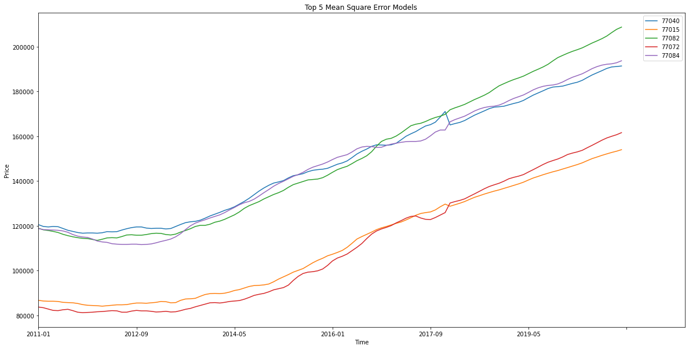
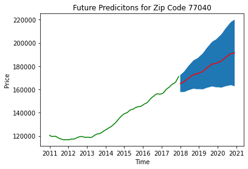
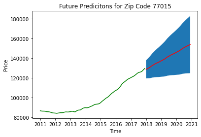
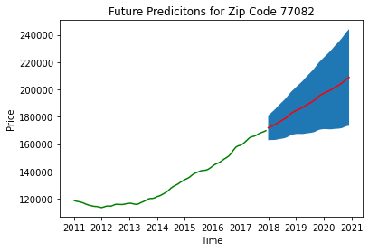
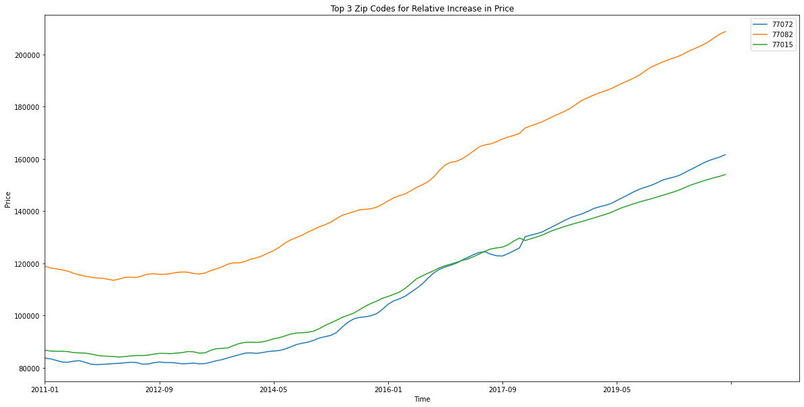

# Houston Housing Price Prediction Models

## Business Understanding

I will be using a time series model to conclude which Harris County Texas zip codes produce the best model. I will determine which model varies less through time to present the zip code investment with the least risk.

### Data

The data used is the housing markets from 2011-2016 of the top 15 size ranked zip codes in Harris county Texas. The year 2017 is used as the test set to predict from 2018-2020.

Zip Codes:
- 77084
- 77036
- 77077
- 77095
- 77082
- 77057
- 77007
- 77070
- 77081
- 77063
- 77042
- 77072
- 77015
- 77008
- 77040

## Method 

- Used SARIMAX to negate the trend affects and measure the auto regression and moving average. 
- Mean squared error to test model predictors. 
- Find relative increase in price from top predictors. 

### Top 5 Models with Mean Squared Error

These are the top models when checked for mean squared error. 

Zip Code: 77040

Date: 2011-10
Minimum Value: $116700.0

Date: 2020-12
Maximum Value: $191406.78

---------------------------------------------------------------------------

Zip Code: 77015

Date: 2012-02
Minimum Value: $84100.0

Date: 2020-12
Maximum Value: $154015.97

---------------------------------------------------------------------------

Zip Code: 77082

Date: 2012-01
Minimum Value: $113500.0

Date: 2020-12
Maximum Value: $208781.13

---------------------------------------------------------------------------

Zip Code: 77072

Date: 2011-10
Minimum Value: $81200.0

Date: 2020-12
Maximum Value: $161626.68

---------------------------------------------------------------------------

Zip Code: 77084

Date: 2012-10
Minimum Value: $111600.0

Date: 2020-12
Maximum Value: $193743.94

---------------------------------------------------------------------------

Date and value of minimum and maximum housing price from 2011-2020.

### Top 3 Models for Mean Squared Error for Predicted Mean and Confidence Interval

These models for zip codes 77040, 77015, 77082 have the smallest confidence intervals, therefore have a more predictable future value to pose less risk to the customer.

### Top 3 Zip Codes for Relative Increase in Price

Looking at the 3 selected models. 

## Conclusion

These zip codes are estimated have the most accurate models predicting 2018-2020, and most relatively profitable price increase from 2011-20. 
- 77082
- 77015
- 77072

